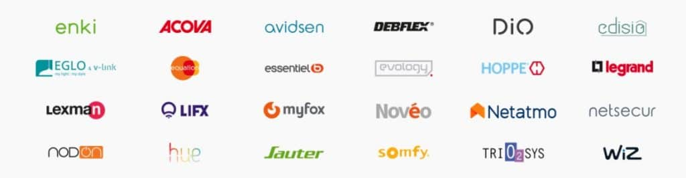
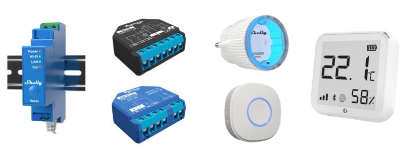
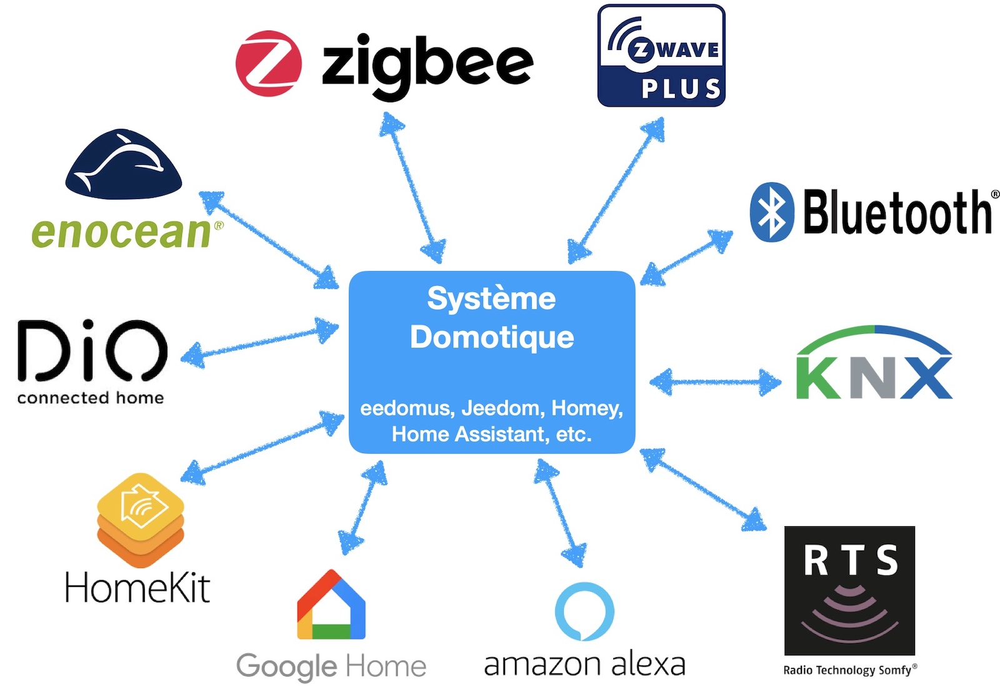
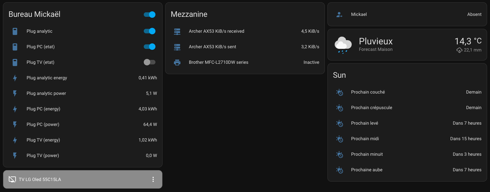
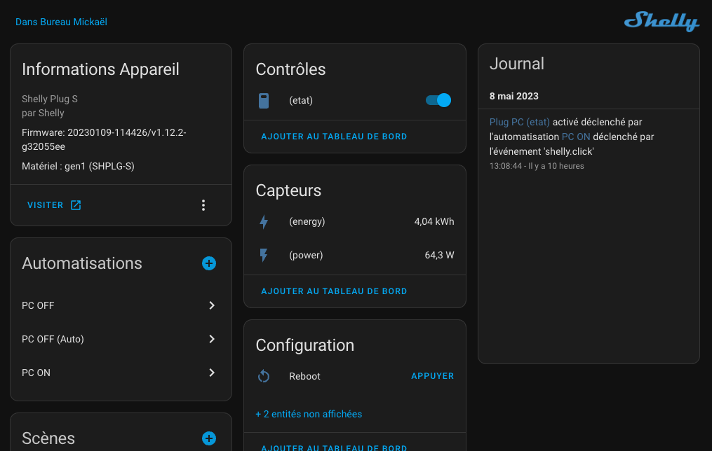
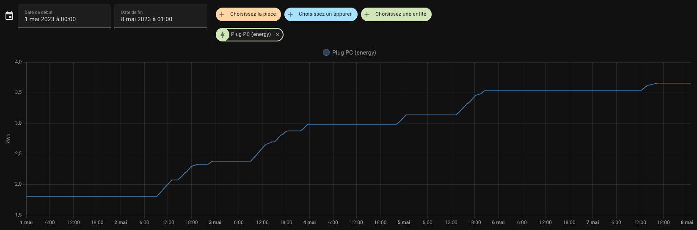
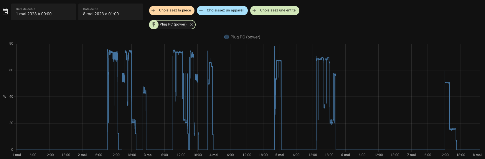

# Domotique

À la découverte d'un monde sans limite

<!-- .slide: data-background="./images/bg.jpg" data-background-opacity=".3"-->

---

## Sommaire

1. [Un peu de contexte](#contexte)
2. [Le marché des composants](#le-marché)
3. [Les systèmes domotiques existants](#les-systèmes-domotique)
4. [Mes premières expériences](#mes-expériences)
5. [Puis, ça a dérapé...](#plus-loin-que-prévu)

---

## Contexte

Ça faisait longtemps que je souhaitais m'y pencher, mais je ne savais pas par où commencer...

Jusqu'à l'augmentation du coût de l'électricité ! ⚡

> Oh my god !

--

### Mon besoin

Mon premier besoin était celui de mieux gérer ma consommation électrique.

--

### Les chantiers

J'ai donc lancé 2 sujets en parallèle :

- Les panneaux photovoltaïques ☀️
- La domotique 🤖

---

## Le marché

Commençons par regarder ce qu'il existe pour faire de la domo...

> Ah ouais... il y a de quoi s'amuser !

--

### Restons focus

Au vu de ce monde hyper vaste, j'ai affiné ma recherche sur plusieurs critères :

1. Constructeurs européens
2. Mesurer finement la consommation
3. Solution durable et modulaire

--

### L'heureux élu

Je suis donc parti chez [**Shelly**](https://www.shelly.cloud/fr/company/about-shelly), c'est la marque phare de l'entreprise **Allterco Robotics**, située en Bulgarie.

Aussi, ils possèdent également une filiale en France.

--

### Mais pourquoi ?!

Le rapport qualité/prix et surtout la flexibilité et la compatibilité des composants.

> Et en plus ça se configure facilement hors de l'app propriétaire !

---

## Les systèmes

Acheter des composants, c'est bien. Les piloter, c'est mieux.

> Wow ! Là aussi, il y a du monde !

--

### Étude rapide

Pour le coup, je n'ai pas perdu beaucoup de temps ici, car ça s'est fait au travers de discussions avec d'autres passionnés du sujet 👌.

--

### Le gagnant est... 🥁

Étant open source, hyper connu / utilisé et très fortement maintenu, je suis parti sur [**Home Assistant**](https://www.home-assistant.io/).

--

### Le gros avantage

Voici la phrase qui m’a quasiment convaincu instantanément :

> Ce qui est génial avec Home Assistant c'est sa communauté ! En effet, c'est assez rare de ne pas trouver une réponse / un module sur le market répondant à une problématique que tu vas rencontrer.

--

### HA x Raspberry Pi

En fouillant un peu avant de me lancer, j'ai remarqué aussi que l'outil était compatible avec Raspberry Pi.

> Ça tombe bien, j'en avais une à recycler ! ♻️

---

## Mes expériences

> Allez, c'est parti pour l'aventure ! 🤝

--

### Home Assistant 🛠️

On installe [Home Assistant sur la Raspberry Pi](https://www.home-assistant.io/installation/raspberrypi/).

--

### Shelly France 🇫🇷

On commande ce qu'il faut :

- Des blocs prise murale
- Des boutons
- Des prises

--

### On paramètre tout bien 👨‍💻

> Magie, ça trouve des trucs tout seul !

--

### On fait les scénarios 🤔

--

### Récupération des métriques 📈

Consommation totale sur une semaine

--

### Récupération des métriques 📈

Consommation réelle sur une semaine

---

## Plus loin que prévu

Le premier test étant concluant, j'aurais pu répéter le processus et m'arrêter là...

Mais c'était bel et bien la boîte de pandore que je venais d'ouvrir...

--

### Et si...

J'ajoutais le pilotage de mes radiateurs ?

--

### Et si...

J'ajoutais le pilotage de mes volets roulants

--

### Est-ce...

Mes portes de garage sont pilotables ?

...

Non ? OK, que faire pour que ça le soit ?

--

### Mais...

J'ai un système d'alarme chez moi, pourquoi ne pas le rattacher ?

--

### Quoi ?!

Ça gère aussi le pilotage de mes lumières Philips HUE ?!

--

### Quoi ?!

C'est capable de piloter mes TV connectées et même remonter des métriques de mon téléphone ?!

--

### C'est fou !

Les scénarios sont illimités !

--

### Bref.

Je me suis lancé dans la domotique.

---

## Auteur

https://github.com/Bearunik
